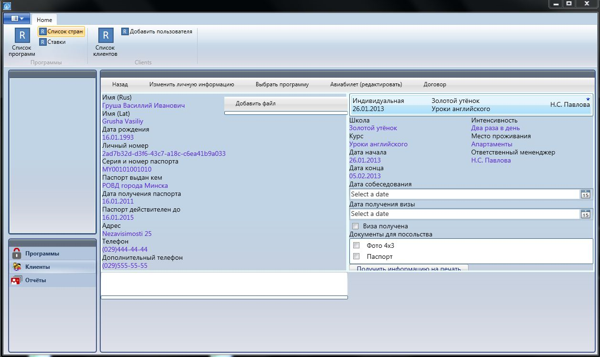
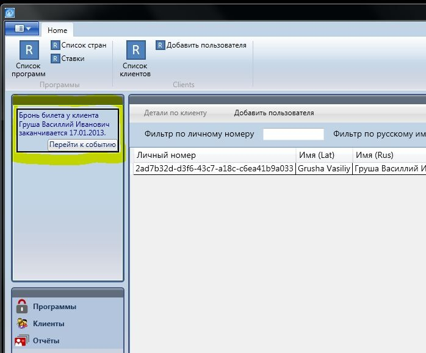
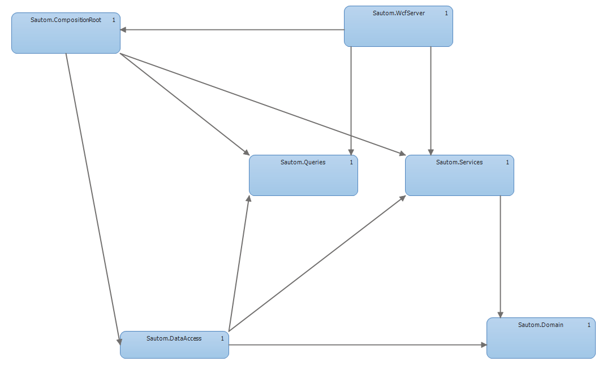
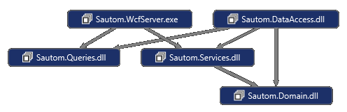

# sautom-wpf

*Sautom code and architecture example project.*

+Used technologies:+
1) EF code first, LINQ to Entities;
2) WCF - comunication;
3) WPF - client;
4) Microsoft Prism Library, Unity DI, Automapper, Open XML;
5) (+) DDD and CQRS development principles.

*User interface:*

*The layered project structure:* 

*Main assemblies diagram:* 

*Project structure:*

