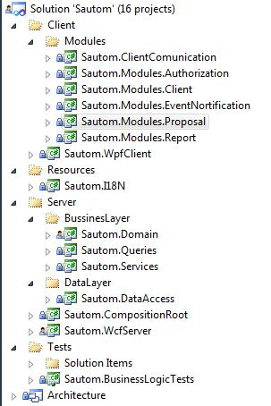

# sautom-wpf

Sautom code and architecture example project. 

_Used technologies:_
1) EF code first, LINQ to Entities;
2) WCF - comunication;
3) WPF - client;
4) Microsoft Prism Library, Unity DI, Automapper, Open XML;
5) (+) DDD and CQRS development principles.

**User interface:**

**The layered project structure:**

**Main assemblies diagram:**

**Project structure:**

